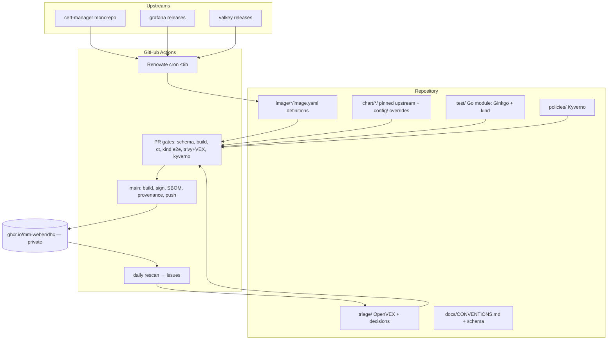

# Technical Design Document

## Overview

**Purpose**: A miniature DHI-style hardened-image catalogue ("dhc") that exercises, with real
industry tooling, every responsibility of a Docker Hardened Images engineering role: definition
authoring, chart adaptation, upstream tracking, Go-based integration testing, and CVE triage.

**Users**: The project owner (as catalogue maintainer and job candidate); later, reviewers of the
repository evaluating maintainer craft.

**Impact**: New repository built from empty in three workdays, then left operating (Renovate cron,
daily rescans) so genuine maintainer history accumulates unattended. Private until explicitly
released (Req 2.4).

### Goals

- Author four archetypal image definitions with DHI-grade pinning discipline (Req 1)
- Operate real automation: Renovate bump PRs, CI gates, daily scans (Req 3, 6)
- Adapt three upstream charts to hardened non-root images via overrides only (Req 4)
- Prove hardening on live Kubernetes with Go integration tests (Req 5)
- Keep every decision explainable — the owner must be able to defend each one in an interview

### Non-Goals

- mongodb / kyverno / istio images or charts (post-MVP additions once the pattern exists)
- FIPS/STIG variants, ELS, registry mirroring, Docker Scout wiring, full SLSA L3 hermeticity
- Any custom build engine beyond the thin fallback renderer (no wheel-reinvention)
- Public release ceremony — deferred until the owner flips visibility

## Architecture

### High-Level Architecture



### Technology Stack

| Layer | Technology | Rationale |
|-------|------------|-----------|
| Definitions | Real `dhi.io/build` syntax (spike A) or DHI-style YAML + thin renderer (fallback B) | Req 1.7/1.8; literal job practice first, transparent fallback second |
| Build | BuildKit / buildx bake, GitHub Actions | Docker-native, no bespoke engine |
| Tracking | Renovate self-hosted (`renovatebot/github-action`) | Industry standard for monorepo/fleet tracking; `postUpgradeTasks` recomputes source checksums (hosted app forbids them) |
| Charts | Upstream charts + values overrides (rudder-style `config/`) | Upstream untouched; deviations reviewable (Req 4) |
| Tests | Go, Ginkgo v2 + Gomega, sigs.k8s.io/e2e-framework, kind, chart-testing (`ct`) | Req 5.1; the JD's Go lives here |
| Policy gate | Kyverno CLI against rendered charts | Reuses owner's lab policies; admission-shaped CI gate |
| Scanning/VEX | Trivy (gate + cron), Grype (second opinion), Syft (SBOM), OpenVEX/`vexctl` | Req 6; DHI's own triage model |
| Signing | cosign keyless (GitHub OIDC) + buildx provenance | Req 2.2 |

### Key Design Decisions

1. **Real DHI frontend first, thin renderer fallback (Req 1.7/1.8)**
   - **Context**: The JD's first bullet is authoring definition files; DHI's catalog is open source.
   - **Options**: (A) build with Docker's `# syntax=dhi.io/build` frontend; (B) DHI-style YAML rendered to Dockerfiles; (C) plain Dockerfiles FROM dhi.io bases.
   - **Decision**: Spike A on the owner's host, timeboxed 3h; fall back to B. C rejected (abandons definition authoring).
   - **Trade-offs**: A risks entitlement/black-box friction; B adds ~small glue we maintain.

2. **Renovate self-hosted, not custom tracker, not hosted app**
   - **Context**: "No wheel-reinvention"; source pins carry checksums Renovate cannot natively recompute.
   - **Decision**: `renovatebot/github-action` on cron with regex managers, monorepo grouping, Dependency Dashboard for majors, automerge for digest-only patches (Req 3).
   - **Trade-offs**: We own the runner config; slower than hosted app to first PR.

3. **Stale-pin bootstrap for immediate real history (Req 3.6)**
   - **Decision**: Initial pins sit ≥1 release behind latest so Renovate opens genuine PRs (including one real major staged in the dashboard) from day 1; cron keeps history growing after the 3 days.
   - **Trade-offs**: First builds are of slightly-old versions; acceptable, honest, and itself demonstrates the bump flow.

4. **Hardening via overrides, never forked charts (Req 4)**
   - **Decision**: Pin upstream chart version; all changes live in `config/values-hardened.yaml` + per-chart README rationale; compat decisions documented when a chart assumes a shell.

5. **VEX-gated scanning (Req 6)**
   - **Decision**: Trivy PR gate fails only on findings not covered by our OpenVEX; triage outcomes are commits (VEX statement or bump PR), giving auditable history.

## System Flows

### Upstream bump flow (the operating heart)

```mermaid
sequenceDiagram
    participant U as Upstream release
    participant R as Renovate (cron)
    participant PR as Pull Request
    participant CI as CI gates
    participant M as main / release job
    participant G as GHCR (private)

    U->>R: new tag matches version policy
    R->>PR: bump pin+checksum (grouped; majors → dashboard)
    PR->>CI: schema+conventions → build → ct → kind e2e → trivy+VEX → kyverno
    CI-->>PR: checks green (digest-only patch: automerge)
    PR->>M: merge (human review otherwise)
    M->>G: multi-arch build, cosign sign, SBOM, provenance, push
    G->>CI: daily rescan → new CVE? issue → VEX or fix-bump PR
```

## Components and Interfaces

### image/<name>/ — definitions (Req 1, 2)
One directory per component; `image.yaml` in DHI schema shapes: `vars` (upstream version + regex
extraction), `files` (git+https source, `checksum:`), `contents`/`builds` (stages), `outputs`
(uid/gid/mode), `accounts` (nonroot 65532), `platforms` (amd64/arm64). cert-manager is one
definition producing three images (controller/webhook/cainjector) from one version var.
Consumed by: CI build workflow; watched by: Renovate regex managers.

### chart/<name>/ — adaptations (Req 4)
`chart.yaml` (pinned upstream chart source+version), `config/values-hardened.yaml` (image swap to
digest-pinned refs + restricted-PSS securityContext + emptyDir mounts), `README.md` (every
deviation + rationale + compat decision). Consumed by: ct, kind e2e, kyverno gate.
Additionally `chart/hardened-app/` carries the owner's lab chart over unchanged — an owned chart,
not an upstream adaptation (outside Req 4.1), giving Req 5.5's hardened-app probe a deploy path.

### test/ — Go module (Req 5)
Ginkgo v2 suites per component under `test/e2e/`; e2e-framework provisions kind; shared helpers
for install/upgrade, readiness, live securityContext assertion, functional probes. Entry:
`go test ./test/e2e/... -args --chart <name>`; CI matrix runs affected components only.

### triage/ — decisions (Req 6)
`triage/vex/*.openvex.json` (authored via vexctl, attached with cosign attest),
`triage/LOG.md` (dated decisions: finding → EPSS/KEV → outcome → link). Consumed by Trivy gate.

`triage/accepted-risk/<image>.yaml` (Req 6.7–6.12) covers the two treatments VEX
must never express. Risk has four treatments — avoid (drop the component),
mitigate (bump/patch, Req 6.5), transfer (upstream owns the fix), accept (ship
knowingly) — and before this the gate had machinery only for the first two plus
`not_affected`, so a real-and-unfixable finding could block an image forever with
VEX as the only pressure valve. That is VEX-washing, which Req 6.8 forbids.

The split is by *question*: **VEX answers "does this apply?"** — a claim about the
artifact, evidence-backed, attested, no expiry. **accepted-risk answers "what are
we doing about it?"** — a decision about our exposure, internal, never attested,
and it expires. Transfer gets no separate file: while waiting on upstream we are
still carrying the risk, so it is an acceptance with an external owner.

Mechanically these are native Trivy ignorefiles (`--ignorefile`, one per image so
an acceptance for grafana never silently covers cert-manager), composed with
`--vex` in the same scan. Verified against Trivy 0.72.0: a future `expired_at`
suppresses, a past one is silently counted again, versionless `purls:` scope to
one package, and suppressions surface in `ExperimentalModifiedFindings` with a
`Source` that distinguishes VEX from acceptance. So **acceptance decays back to
un-triaged on its own** (Req 6.9) — the property that makes it safe. Our glue is
only what Trivy lacks: `scripts/lint-accepted-risk.sh` enforcing required fields,
the 90-day ceiling, and that no ignorefile lives anywhere else (Req 6.11–6.12),
plus expiry reporting (Req 6.10), since Trivy logs nothing when an entry lapses.

Each entry carries a `blocked:` field stating why avoid and mitigate were
unavailable — presence machine-enforced, content judged at review. It is what
keeps the file from becoming the path of least resistance.

**Reachability evidence (Req 6.13–6.15).** Trivy and Grype answer "is this
module linked", never "is the vulnerable code called". Every `not_affected`
statement in this catalogue rested on architectural argument instead — sound and
checkable, but weaker than a measurement, and useless against an advisory like
kin-openapi's fail-open `ValidationHandler`, where applicability turns entirely
on whether one symbol is wired in. `govulncheck -mode=binary` reads the Go
binary's symbol table and distinguishes the two, so it runs on the PR path
against every Go binary in the built image.

It is **evidence, not a gate** — Trivy remains the only thing that fails a
build. A reachability tool that can also break CI is a second gate nobody
designed, and its false negatives would then silently pass images.

Split like `triage/rescan/`: `scripts/govulncheck-report.sh` is the pure,
unit-tested part (govulncheck JSON → per-binary table of OSV, module and
`symbol` / `package` / `module` level) and the workflow is the I/O around it
(export the container rootfs, find Go binaries, run govulncheck, print). The
level is the discriminator: a finding whose trace names a function is reachable;
one reported at module level only proves nothing either way — which is also what
a stripped binary looks like, so the report says which it was.

Req 6.14 makes the direction one-way on purpose. A reachable symbol *forbids*
`not_affected`; an unreachable one does not compel it, because govulncheck sees
only Go call graphs and not reflection, plugins or `exec`.

**Statement identity (Req 6.17–6.22).** A VEX statement that matches nothing is
indistinguishable from one that worked, so `scripts/lint-vex-product.sh` checks
the identifiers Trivy compares: the product is a `pkg:oci/` purl naming a real
definition (6.17), its `repository_url` equals that definition's `image:` (6.18),
and subcomponents are versionless so they survive an upstream bump (6.19).

Whether the *product* carries a version depends on the status, because the two
statuses make different kinds of claim:

- `not_affected` is a claim about **code structure** — the vulnerable path is not
  reachable in this image. That stays true across rebuilds, so the product is
  versionless (6.20). Pinning the digest would make the statement suppress until
  the next build and then silently stop.
- `fixed` is a claim about **specific versions** containing a remedy. Stated
  versionless it asserts every image we publish under that name is fixed, which
  is false the moment an older tag remains in the registry — so the product
  carries a version (6.21).

One rule for both would be wrong for one of them. The distinction only became
visible when a `not_affected` finding was later resolved by an upstream bump.

Req 6.22 keeps that transition on the record. OpenVEX documents hold multiple
timestamped statements and consumers take the latest per (vulnerability,
product), so a superseded claim is retained rather than deleted: the artifact
carries what we argued, when, and what replaced it.

### .github/workflows/
`validate.yml` (schema/yamllint/conventions), `build.yml` (PR build + gates; main: release),
`e2e.yml` (kind matrix), `renovate.yml` (cron ≤6h), `rescan.yml` (daily; opens issues).

**Build cost split (validated on the first CI run):** the PR gate builds
`linux/amd64` only — fast proof a definition compiles — while the release path
(main) builds both arches per Req 2.1. arm64 through the frontend runs cross-
compiled or QEMU-emulated on an amd64 runner; paying that once at merge, not on
every PR, keeps PR feedback fast. Both paths use `type=gha` build cache
(per-image scope) so repeat builds of a large upstream (cert-manager, ~30–40 min
cold multi-arch) reuse the Go module + compile layers.

## Data Models

Definition schema (fallback-B shape, mirroring real DHI fields; JSON Schema enforced in CI):

```yaml
name: grafana
vars:
  version: "11.3.0"            # Renovate-managed; regex-extracted tag segments
files:
  - url: git+https://github.com/grafana/grafana.git#v${version}
    checksum: sha256:...       # postUpgradeTasks recompute
contents:
  base: gcr.io/distroless/static-debian12@sha256:...   # digest-pinned always
builds:
  - stage: fetch|build|runtime steps (pipeline: runs/uses)
outputs:
  - source: ...; target: /usr/share/grafana; uid: 65532; gid: 65532
accounts:
  runtime: {user: nonroot, uid: 65532}
platforms: [linux/amd64, linux/arm64]
```

## Error Handling

| Failure | Response | Requirement |
|---------|----------|-------------|
| Definition violates schema/pinning | validate.yml fails naming the rule and reference | 1.5, 1.6, 7.4 |
| Upstream bump breaks build | PR stays red; failure is the triage/fix work, documented in CONVENTIONS | 2.5 |
| Renovate mis-parses a pin | regex managers carry unit fixtures in repo; dashboard shows detection state | 3 |
| kind flake / timeout | one retry per suite; diagnostic logs uploaded as artifacts | 5.7 |
| Trivy DB outage | PR gate hard-fails (retryable); daily rescan soft-fails with issue | 6 |
| New CVE on published image | issue with severity/EPSS/KEV → VEX statement or fix-bump PR | 6.3–6.5 |

## Testing Strategy

### Unit Tests
- Renovate regex-manager fixtures (does this pin string parse?); schema negative cases; TDD on any fallback-renderer glue (per repo CLAUDE.md).

### Integration Tests
- Req 5 suite: per-chart install on kind → Ready ≤5min → live securityContext assertions → functional probes (Certificate issued; grafana HTTP health; valkey SET/GET; hardened-app 200) → upgrade path on bump PRs.

### E2E / Pipeline
- ct lint+install per changed chart; kyverno CLI over rendered manifests (digest, registry, nonroot); trivy gate with VEX; full bump-flow rehearsal via one deliberately stale pin per component.

## Security Considerations

- Non-root 65532 everywhere; restricted PSS enforced twice (chart overrides + kyverno gate)
- Everything digest/checksum-pinned; floating tags fail CI (Req 1.6)
- cosign keyless via GitHub OIDC — no long-lived signing keys; PAT stays in `.keys/` (gitignored)
- Private repo + private GHCR until owner flips (Req 2.4); no secrets in definitions

## Delivery Plan (3 workdays, cut line explicit)

- **Day 1**: skeleton, CONVENTIONS, validate.yml; host spike of `dhi.io/build` (3h box → decision A/B); hardened-app + cert-manager definitions building, signed, pushed; stale pins set.
- **Day 2**: Renovate live (first real bump PRs incl. staged major); grafana + valkey definitions; cert-manager + grafana chart adaptations + kyverno gate.
- **Day 3**: Ginkgo/kind suite across all four; triage lane + first real VEX; valkey chart; README narrative (lab → catalogue arc); cron left running.
- **Cut from tail**: valkey chart → valkey image → grafana upgrade-test depth. **Never cut**: operating Renovate, one full chart adaptation, one real VEX decision.

## Development Process

Per repo CLAUDE.md: requirements writing in EARS (this spec), progress managed in scalable bits
with the agent-orchestration plugin, TDD wherever coding applies (renderer glue, test helpers).
Heavy operations (builds, kind, pushes) run in GitHub Actions or on the operator host — never in
the restricted devcontainer (Req 8).
