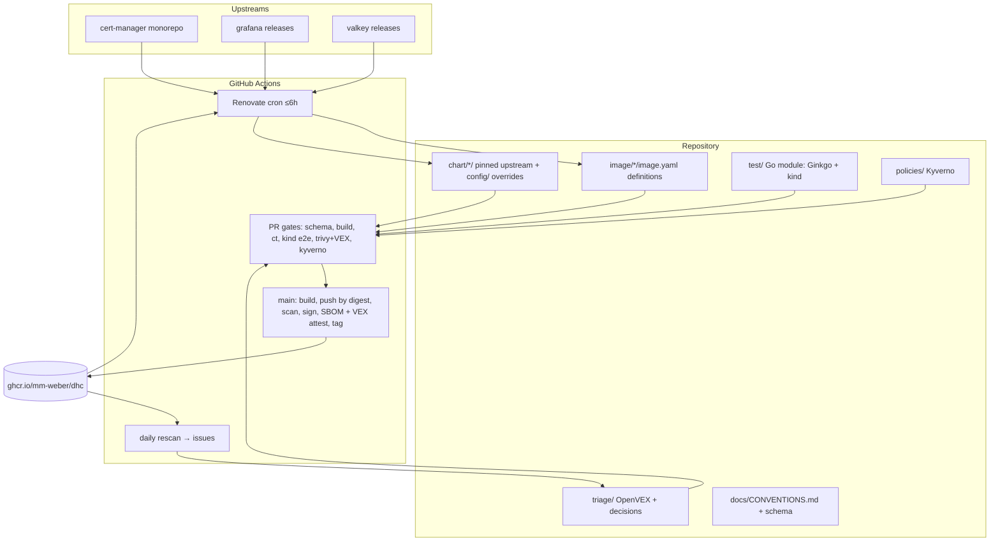

# Technical Design Document

## Overview

**Purpose**: A miniature DHI-style hardened-image catalogue ("dhc") that exercises, with real
industry tooling, every responsibility of a Docker Hardened Images engineering role: definition
authoring, chart adaptation, upstream tracking, Go-based integration testing, and CVE triage.

**Users**: The project owner (as catalogue maintainer and job candidate); later, reviewers of the
repository evaluating maintainer craft.

**Impact**: New repository built from empty in an initial three-workday MVP (2026-07-18 →
2026-07-21), then left operating (Renovate cron, daily rescans) so genuine maintainer history
accumulates unattended — the operating period is what grew tasks 7.4–8.7. Private throughout the
build (Req 2.4); released publicly under MIT on 2026-08-13.

### Goals

- Author four archetypal image definitions with DHI-grade pinning discipline (Req 1)
- Operate real automation: Renovate bump PRs, CI gates, daily scans (Req 3, 6)
- Adapt three upstream charts to hardened non-root images via overrides only (Req 4)
- Prove hardening on live Kubernetes with Go integration tests (Req 5)
- Keep every decision explainable — the owner must be able to defend each one in an interview

### Non-Goals

- mongodb / kyverno / istio images or charts (post-MVP additions once the pattern exists)
- FIPS/STIG variants, ELS, registry mirroring, Docker Scout wiring, full SLSA L3 hermeticity
- Any custom build engine beyond the thin fallback renderer (no wheel-reinvention;
  moot since ADR 0001 retired fallback B)
- Public release ceremony — deferred until the owner flips visibility (flipped 2026-08-13)

## Architecture

### High-Level Architecture



### Technology Stack

| Layer | Technology | Rationale |
|-------|------------|-----------|
| Definitions | Real `dhi.io/build` syntax — spike A succeeded, fallback B retired (ADR 0001) | Req 1.7/1.8; literal job practice; the frontend compiling each definition is the schema gate |
| Build | BuildKit / buildx bake, GitHub Actions | Docker-native, no bespoke engine |
| Tracking | Renovate self-hosted (`renovatebot/github-action`) | Industry standard for monorepo/fleet tracking; `postUpgradeTasks` recomputes source checksums (hosted app forbids them) |
| Charts | Upstream charts + values overrides (rudder-style `config/`) | Upstream untouched; deviations reviewable (Req 4) |
| Tests | Go, Ginkgo v2 + Gomega, sigs.k8s.io/e2e-framework, kind, chart-testing (`ct`) | Req 5.1; the JD's Go lives here |
| Policy gate | Kyverno CLI against rendered charts | Reuses owner's lab policies; admission-shaped CI gate |
| Scanning/VEX | Trivy (gate + cron), Grype (second opinion), Syft (SBOM), OpenVEX/`vexctl` | Req 6; DHI's own triage model |
| Signing | cosign keyless (GitHub OIDC) + buildx provenance | Req 2.2 |

### Key Design Decisions

1. **Real DHI frontend first, thin renderer fallback (Req 1.7/1.8)**
   - **Context**: The JD's first bullet is authoring definition files; DHI's catalog is open source.
   - **Options**: (A) build with Docker's `# syntax=dhi.io/build` frontend; (B) DHI-style YAML rendered to Dockerfiles; (C) plain Dockerfiles FROM dhi.io bases.
   - **Decision**: **A** — the timeboxed spike produced working builds in native DHI syntax, so
     fallback B was retired (ADR 0001, accepted). Every definition opens with a digest-pinned
     `# syntax=dhi.io/build:…` directive; the frontend compiling each changed definition in
     `build.yml` is the schema-conformance gate (Req 1.5), while `validate.yml`/`lint-pins.sh`
     covers pinning conventions.
   - **Trade-offs**: the frontend is a black box we don't control; accepted because it is the
     literal tool of the role being practiced. C rejected (abandons definition authoring).

2. **Renovate self-hosted, not custom tracker, not hosted app**
   - **Context**: "No wheel-reinvention"; source pins carry checksums Renovate cannot natively recompute.
   - **Decision**: `renovatebot/github-action` on cron, custom regex managers **only** (every
     built-in manager disabled, so nothing opens a surprise PR) — one manager per pin surface.
     The two definition archetypes split by how a bump is made coherent:
     *compile-from-source* (github-tags datasource; `refresh-definition.sh` resolves the tag to a
     commit and recomputes checksum/vars/tags/ldflags) and *tarball-repackage* (github-releases
     datasource; `refresh-grafana.sh` resolves the opaque build id from three cross-checked
     indexes, re-pins both per-arch SHA-256s from the `dl.grafana.com` sidecars, and an explicit
     `versioningTemplate` ranks `+security-NN` builds semver would silently equate — **ADR 0002**).
     Further surfaces: the dhi.io build layer (docker datasource), chart image pins and the
     pinned toolchain (both below). Monorepo grouping, Dependency Dashboard for majors (Req 3.4);
     automerge covers digest **and patch** updates on the github-tags datasource, gated on CI —
     broader than Req 3.5's minimum, and repackage bumps never automerge (they swap a binary we
     did not build).
   - **Trade-offs**: We own the runner config; slower than hosted app to first PR.

3. **Stale-pin bootstrap for immediate real history (Req 3.6)**
   - **Decision**: Initial pins sit ≥1 release behind latest so Renovate opens genuine PRs (including one real major staged in the dashboard) from day 1; cron keeps history growing after the 3 days.
   - **Trade-offs**: First builds are of slightly-old versions; acceptable, honest, and itself demonstrates the bump flow.

4. **Hardening via overrides, never forked charts (Req 4)**
   - **Decision**: Pin upstream chart version; all changes live in `config/values-hardened.yaml` + per-chart README rationale; compat decisions documented when a chart assumes a shell.

5. **VEX-gated scanning (Req 6)**
   - **Decision**: Trivy PR gate fails only on findings not covered by our OpenVEX; triage outcomes are commits (VEX statement or bump PR), giving auditable history.

6. **Publish with status: scan what you sign (Req 2.7 to 2.25, 6.35, 6.36; review F3, F9, F6, 2026-08-21)**
   - **Context**: Every scan step in `build.yml` was `pull_request`-gated while the release arm
     rebuilt, pushed, signed and attested without any scan (review A finding 1.3, left open
     since 2026-08-04). Package versions float by design, so the released bytes could differ
     from the gated ones, and nothing rebuilt on a schedule, so a fixed base package reached
     consumers only after an unrelated commit. Ten legacy tags still resolved to indexes whose
     arm64 manifest nobody ever scanned, two of six repositories were private while the README
     called every image public, and the consumer verification snippet matched any identity
     containing `github.com/mm-weber/dhc-pipeline` as a substring.
   - **Options**: (A) publish with status: push by digest, scan the pushed digest, record
     anything uncovered as `under_investigation` in the attested VEX, then tag; (B) fail
     closed on `main` until a human decides; (C) scan after publish as information only.
     For packages: declare the float, or pin apk versions (needs a spike plus a bespoke
     Renovate datasource), or lock-and-compare. For cadence: daily rebuild publishing only
     when content changed, or rescan-triggered rebuilds, or both.
   - **Decision**: **A**, under the review's framing of a transparency catalogue (knowledge,
     not speed). The release sequence becomes push-by-digest (no tag), scan that digest per
     platform with the gate's own VEX and exception inputs, compile VEX for exactly that
     digest (and for every platform manifest digest, Req 6.36) as exactly one document per
     digest, empty when nothing applies (ADR 0003, measured 2026-08-22 against vexctl,
     Trivy, cosign v2 and v3, and Kyverno; cosign stays pinned on the v2 line because v3's
     bundle layout is invisible to Kyverno 1.18 and Trivy 0.72), sign the index and every
     platform manifest and attest to each (`--recursive`; one SBOM per platform manifest,
     the single OpenVEX document on index and platform manifests, so a consumer pinning
     either form verifies; revision finding 1.8), and only
     then apply tags (`docker buildx imagetools create -t …`). "Published" is thereby defined
     (Req 2.10): tagged, signed, attested; an untagged digest is frozen (Req 2.11). A finding
     uncovered at release time becomes an `under_investigation` statement with a timestamp
     (Req 2.12); the issue link arrives with the next rescan and cluster B's re-attestation,
     so the signing job keeps `contents: read`, `packages: write`, `id-token: write` and gains
     no `issues: write` (a least-privilege refinement of the review's wording, which had the
     statement carry the issue reference from the start). apk packages float by declaration
     (Req 1.9): the DHI model ships base fixes by rebuilding, no versioned apk syntax exists in
     any input, and the SBOM already records the resolved set per digest. A daily scheduled
     rebuild publishes only when the resolved package set changed (Req 2.14 to 2.16), which
     is what stops provenance timestamps alone from minting digests and opening chart-pin
     PRs. arm64 returns when, and only when, both the release-time scan and the rescan scan
     every platform manifest (Req 2.18 to 2.20; task 8.3 is absorbed by task 9.3). The ten
     legacy tags are not re-pointed (cosign signed the index only, so a re-pointed tag
     would serve an unsigned manifest; independent review 1.2, measured): the rescan
     enumerates every catalogue tag daily and scans every platform manifest of every
     tag-referenced digest instead (Req 2.18, 2.22), satisfying Req 2.6 as written with
     every existing signature intact; critique F9 (a) amended 2026-08-22.
     Visibility becomes a daily invariant (Req 2.21). Verification inputs live in one
     declared place as **roles**: the *releaser* (`build.yml` at `refs/heads/main`) is the
     sole signer and sole SBOM attestor and attests the first OpenVEX document; the
     *re-attester* (`rescan.yml` at `refs/heads/main`, active from cluster B) may attest
     OpenVEX only, never sign, never tag. Each role is one attestor list in the Kyverno
     `verifyImages` rendering (signature attestors, then per-predicate-type attestors),
     proven daily over every tag-referenced digest and one unsigned control (Req 2.20,
     2.23 to 2.25). The identity in a certificate therefore tells a consumer which role
     produced what they are reading. A fork adds roles as lines (a dedicated signing
     workflow behind a protected environment, a revocation job with `packages: write` and
     no `id-token`), never by widening an existing role (revision finding 1.11).
   - **Trade-offs**: B was rejected as speed-shaped: one maintainer accumulates blocked
     releases while an unrelated advisory lands between PR scan and merge. Pinning apk would
     reinvent a datasource and turn every base advisory into a bump PR. Deleting the legacy
     indexes would break every digest pin for a hazard that is "unscanned", not "known bad".
     Two declared switches make the fork's choice a value, not a redesign: the fail-closed
     release setting (Req 2.13) and the publish policy `on-change` versus `always`
     (Req 2.17); the cron expression is a third.
   - **Reproducibility, weighed 2026-08-22 (revision finding A1)**: a bit-identical rebuild
     would make "nothing changed" a digest comparison and turn provenance into a recomputable
     fact, and BuildKit has the knobs (`SOURCE_DATE_EPOCH`, `rewrite-timestamp`, provenance
     `reproducible`). It is not the gate, for the reasons
     `data/reproducible-digests-vs-content-diff-2026-08-22.md` documents: no catalogue vendor
     gates publishing on digest equality (Chainguard reproduces with apko and still rebuilds
     daily, absorbing churn with digestabot; DHI, the same frontend architecture as ours,
     claims no digest stability at all; Red Hat reproduces in Konflux and uses it to verify by
     rebuild-and-diff), and a black-box frontend over apk is exactly where "reproducible" flags
     fail in a long tail nobody outside the frontend can fix. The content comparison (Req 2.15)
     therefore carries four guardrails. It compares a canonicalised sorted set of package type,
     name, version and checksum per platform manifest, never SBOM bytes (Syft's ordering and
     CPE output are not stable). The checksum comes from a CycloneDX SBOM attested beside the
     SPDX one, because Syft's SPDX output records `checksums: null` for apk packages while its
     CycloneDX output carries the apk pull checksum as a component property (measured
     2026-08-22 on `hardened-app:0.1.0-alpine3.23`); DHI publishes both formats. The memo's
     "base-image digest check" is, in this architecture, the definition's pins: frontend,
     builder and every source are digest- or checksum-pinned, so a change to them releases
     through the merge path, and what floats is apk alone, which the pull checksum covers,
     including a package republished under an unchanged version (the CVE-2026-33634 shape).
     Reproducibility stays a verification asset: whenever the sets are equal the comparator
     also logs whether the rebuilt index digest equals the published one, a free nightly
     measurement; a `diffoci` spike on its own branch is the later step, and the condition
     that would promote digest equality to the primary gate is zero residual diff across at
     least 95 percent of images over two weeks.
   - **Scan reports are attested (revision finding A2, 2026-08-22)**: Req 2.12 has the
     compiler add `under_investigation` statements for whatever the release-time scan left
     uncovered, and a scan report that lives only in a job log and a 90-day artifact would
     make the attested document impossible to recompute from its inputs, against the
     principle that compiled output is a deterministic rendering of source (Req 6.28 to
     6.32). It would also collide with cluster B's re-attestation, which re-attests when a
     fresh compile differs from the attested document: a statement whose origin vanished
     either disappears from the fresh compile or returns with a new timestamp every night.
     So the release job attests each platform manifest's Trivy report with cosign's standard
     vulnerability predicate (`https://cosign.sigstore.dev/attestation/vuln/v1`, produced by
     `trivy convert --format cosign-vuln` from the gate's own JSON report, no second scan),
     and Req 6.37 names the compiler's inputs exhaustively: source statements, exceptions,
     the attested scan reports, and any previously attested OpenVEX document. The last input
     is the carry-forward rule cluster B needs: a re-attestation may replace an
     `under_investigation` statement with a decided status or keep it with its original
     timestamp, never drop it and never re-date it. Consumers get the scanner's own result
     in-band, and the F4 clocks read "first seen" from a signed timestamp rather than an
     issue date. Rejected: a workflow artifact alone (expires, unverifiable) and committing
     the statements from the release job (a bot commit to `main`, ruled out under F4 ii).
   - **Declared values live in one file (revision finding A3, 2026-08-22)**: the amendment
     says "declared" for the fail-closed setting, the schedule, the publish policy, the
     admitted platforms and the verification inputs, and a declaration nobody can diff
     undercuts the transparency promise. `catalogue-policy.yaml` at the repository root holds
     three sections: `release` (fail-closed, publish policy, cron expression, admitted
     platforms), `triage` (aperture, ceilings, warning window; cluster B fills it, which
     moves F4 (i)'s `triage/policy.yaml` here without changing that decision) and
     `verification` (issuer, roles with their identities, required predicate types).
     Workflows read the switches at run time with `yq`; the Kyverno policy and the README and
     manual verification snippets are rendered from the `verification` section by a tested
     script, the way `compile-vex.sh` renders VEX, so the consumer instructions cannot drift
     from the policy (Req 7.8, 7.9). Two things GitHub reads only as literal workflow YAML,
     the `schedule:` cron and per-job `permissions:`, stay in the workflows and `validate`
     lints them against the file (Req 7.10). Rejected: repository variables (outside git, no
     pull request, invisible in a fork's diff) and per-workflow `env:` blocks (policy
     scattered across files, snippets hand-transcribed). A fork's switches are then one
     file's values.
   - **Daily invariants are one mechanism (revision finding A5)**: the rescan gains a single
     `invariants` step that runs every daily assertion the catalogue makes about its own
     state, each reported by name and any failure failing the run: anonymous pull per
     repository and tag (Req 2.21) and the verification proof over every tag-referenced
     digest plus the control digest (Req 2.24) from this cluster; the upstream-checksum
     re-check from cluster C (review F2, checkpoint 3); ruleset drift, private vulnerability
     reporting enabled and no tag on a revoked digest from cluster D (F1, F11). One step, one
     report shape, one place a fork adds an invariant.

7. **Statuses and clocks: every known finding carries a published status, and the clocks are read from attestations (Req 6.38 to 6.54; review F5, F4, F13 i; ADR 0003, ADR 0004; 2026-08-23)**
   - **Context**: the two-lane model published only `not_affected` and `fixed`; an accepted
     or transferred finding was invisible to anyone pulling the image, which review A had
     called out on 2026-08-04 and the v2 draft had silently decided against. The exception
     ceiling was a flat 90 days compared with whatever day the lint ran; no clock existed
     for time-to-decision or time-to-fix; the rescan opened issues and never closed them.
     Cluster A then made the published set enumerable, put one OpenVEX document on every
     digest, attested the scan reports and named the compiler's inputs (Req 6.37), which is
     what makes the statuses and clocks below derivable rather than bookkept.
   - **Options**: `affected` statements generated from the exception file, or hand-authored
     beside it, or a human-readable advisory page; re-attestation by appending with a
     consumer-side merge, or by replacing; `timestamp` as first seen or as the status-change
     time; ceilings in the policy file or hand-recorded per exception; metrics to a status
     issue, to a bot-committed file, or to a Pages dashboard.
   - **Decision**: exceptions are published as `affected`. `compile-vex.sh` emits one
     `affected` statement per unexpired exception into the single document (Req 6.38),
     with the action statement assembled from the exception's fields and its timestamp from
     a new required `decided_at` (Req 6.7, 6.11); hand-authored statuses other than
     `not_affected` and `fixed` fail the lint (Req 6.39), which also closes review A's
     `wontfix` gap. Coverage is untouched: neither `affected` nor `under_investigation` ever
     counts (Req 6.35). Re-attestation **replaces** (Req 6.43): ADR 0004 measured that with
     several OpenVEX attestations on a digest `trivy --vex oci` applies one chosen
     nondeterministically, so exactly one attestation per digest and platform manifest is an
     invariant (Req 6.44) proven daily (Req 6.45); history is Rekor plus recompute, and the
     consumer recipe is a single `verify-attestation`. The rescan attests its own scan report
     first, replacing yesterday's (Req 6.42), so Req 6.37's inputs are complete before it
     compiles. A carried-forward statement keeps its `timestamp` as *first seen* for life and
     records changes in `last_updated` (Req 6.40); a lapsed exception re-emits
     `under_investigation` with the original timestamp and a status note (Req 6.41), so the
     decision clock restarts without losing first seen. The numbers live in the `triage`
     section of `catalogue-policy.yaml` (Req 6.49): the decision aperture, ceilings per
     severity as durations, a KEV ceiling, the warning window; `validate` enforces the outer
     ceiling from `decided_at` (Req 6.11), the gate enforces the tier per finding with the
     KEV feed it now fetches (Req 6.50), and the rescan re-evaluates daily because KEV
     status changes after the fact (Req 6.51). The clocks are computed from attestations and
     the enumeration (Req 6.46) and published to one status issue plus a workflow artifact
     (Req 6.47); native badges now (Req 6.48), Pages later. Issues, clocks and the badge run
     over the **supported set**, the digests each definition's current `tags:` reference:
     the industry scopes its promises to version streams because a frozen digest's report
     never changes and its findings accrue by design
     (`data/cve-finding-lifecycle-vs-immutable-tags-2026-08-24.md`: Chainguard states EOL
     images "start to accrue CVEs", Bitnami moved its back catalogue to a no-updates
     namespace); superseded tag-referenced digests keep every knowledge artifact, daily
     scans, attested reports, the re-attested VEX document and the verification proof, but
     hold no issues, so the `cve` badge counts work actually waiting rather than a floor
     that grows with every release. The rescan closes `cve` issues on evidence only
     (Req 6.52 to 6.56) and reopens the same issue when a closed finding returns
     (Req 6.57, the Dependency-Track reactivate pattern: durable identity is the hidden
     marker, history stays on one issue); close labels are graded by evidence, with
     `resolved:fixed` requiring the attested SBOMs to prove the package version bumped,
     never inferred from absence alone, and `resolved:absent` naming the scanner and
     database versions so a feed regression is labelled as what it is. It acts on derived
     state, never on judgement.
   - **Trade-offs**: `rescan.yml` gains `packages: write` and `id-token: write` (rewriting
     an `.att` manifest is a push), widening what a compromised rescan could do to
     "publish a bad attestation or move a tag"; the compensating controls are the role split
     (it cannot mint a signed digest, Req 2.23) and the daily invariants over every
     tag-referenced digest in the same run (Req 2.24, 6.45). `decided_at` is one more field
     a human writes, accepted because every alternative (git dates, LOG headings) moves
     under rebase or reordering. Rejected: hand-authored `affected` (two artifacts for one
     decision), appending with a merge recipe (the consumer's document becomes a coin flip),
     bot commits of a metrics file (violates "everything enters as a pull request"), a Pages
     dashboard now (presentation before the data exists). The daily cost is stated rather
     than implied: today's tag-referenced set is 16 digests with 24 platform manifests
     (measured 2026-08-24), so Req 6.42 is roughly 24 scans (about 35 seconds each) and 24
     keyless scan-report attestations per day, each a transparency-log entry, growing with
     every release until cluster D decides tag retention; the memo records the industry's
     two poles for that decision (Chainguard's 180-day EOL grace against DHI's paid
     five-year extended support). Fork switches: every number in the `triage` section, the
     support statement's tag set, and the `resolved:*` closing labels.

## System Flows

### Release flow (Req 2.7 to 2.17, 2.26; as specified 2026-08-22, implementation task 9)

```
merge to main, the daily schedule, or a manual dispatch
  ─► build (per-arch pins verified) ─► SBOM of the local build output
  ─► scheduled run, publish policy on-change: package set equal to the published
      digest of the full release tag? stop here: nothing pushed, signed or attested
  ─► push by digest, no tag
  ─► compile VEX, pass 1: not_affected / fixed from triage/vex/, stamped with this
      digest and every platform manifest digest, as one document
  ─► scan every platform manifest (by its own digest), VEX + exceptions applied
        no report for any platform manifest ─► sign nothing, tag nothing, red run (2.26)
  ─► attest each platform manifest's scan report (cosign `vuln` predicate, via `trivy convert`)
  ─► compile VEX, pass 2: append under_investigation for every uncovered finding (2.12)
        fail-closed setting on and anything uncovered ─► sign nothing, tag nothing, red run (2.13)
  ─► cosign sign, recursive · SBOM attest per platform manifest · one OpenVEX attest on
      index and platform manifests (ADR 0003)
  ─► apply tags (imagetools create on the index) ─► published (Req 2.10)
```

### Rescan flow (Req 2.18 to 2.24, 6.42 to 6.54; as specified 2026-08-23, implementation task 10)

```
daily 06:17 UTC ─► enumerate every catalogue tag → digest (2.22)
  per tag-referenced digest:
  ─► scan every platform manifest by its own digest (2.18)
  ─► attest each scan report, --replace (6.42)
  ─► compile VEX (6.37): source statements · affected from unexpired exceptions (6.38)
        · carry-forward, timestamp kept, last_updated on change (6.40)
        · lapsed exception ─► under_investigation, original timestamp, status note (6.41)
        · new uncovered finding ─► under_investigation from the attested report
  ─► differs from the attested document? ─► cosign attest --replace on digest + manifests (6.43)
  invariants step (one report shape): anonymous pull per repository and tag (2.21)
        · verification proof + control digest (2.24) · exactly one OpenVEX attestation (6.45)
        · exceptions against current severity and KEV (6.51)
  ─► clocks from attestations over that supported set (6.46) ─► status issue + artifact (6.47)
  ─► issues over that supported set: open (6.3) · close, evidence-graded labels (6.52 to 6.56)
        · reopen on recurrence (6.57) · expiry warnings (6.10)
```

### Upstream bump flow (the operating heart)

```mermaid
sequenceDiagram
    participant U as Upstream release
    participant R as Renovate (cron)
    participant PR as Pull Request
    participant CI as CI gates
    participant M as main / release job
    participant G as GHCR

    U->>R: new tag matches version policy
    R->>PR: bump pin+checksum (grouped; majors → dashboard)
    PR->>CI: parallel gates: validate / build+trivy+VEX+govulncheck / chart (ct lint, kyverno) / kind e2e
    CI-->>PR: checks green (digest and patch bumps: automerge)
    PR->>M: merge (human review otherwise)
    M->>G: build, push by digest, scan per platform, cosign sign, SBOM + one OpenVEX attest, tag (Req 2.7 to 2.9)
    G->>CI: daily rescan → new CVE? issue → VEX or fix-bump PR
```

### Chart pins ride the same loop (task 8.7)

The flow above moves `image/` only; nothing in it would ever touch a chart, which is
how the deployed charts drifted a release behind the registry (issue #64). Two
chart-pin regex managers close that: they read the image references in `chart/**`
values against ghcr's docker datasource, capturing tag **and** digest — so a
definition bump and a *same-tag rebuild* both reach the chart (the digest moves even
when the tag does not), with cert-manager's trio grouped into one PR.

A chart-pin PR is also the ordinary trigger for Req 5.6, giving the upgrade spec two
bump shapes: a **chart-version** bump (`chart/<c>/chart.yaml` `upstream.version`
differs from the base branch) and an **image/values** bump (the deployed values file
differs; `e2e.yml` snapshots the base branch's copy and the suite installs that
state before upgrading — `DHC_UPGRADE_VALUES_FROM`). Upgrade re-asserts wait on
**rollout completion** (`checks.WaitRolloutComplete`, #75): during a rolling update
the old ReplicaSet's pods are still Ready and still backing the Service, so without
that gate a crash-looping bumped image passes the exact assertions Req 5.6 exists
for. Chart *versions* (`chart.yaml`) remain hand-pinned and untracked — a recorded,
separate gap (noted in `chart/cert-manager/chart.yaml`).

## Components and Interfaces

### image/<name>/ — definitions (Req 1, 2)
One directory per definition; `image.yaml` in native DHI schema (see Data Models). cert-manager
is three sibling definitions (`cert-manager-{controller,webhook,cainjector}`) driven by one
upstream version, with byte-equal source pins enforced across them by `scripts/lint-pins.sh`.
A variant that must be *built* rather than merely tagged gets its own directory,
`image/<name>-<variant>/`, publishing to its runtime sibling's repository
(`image/valkey-compat/`; docs/CONVENTIONS.md, "Naming").
Consumed by: CI build workflow; watched by: Renovate regex managers.

### chart/<name>/ — adaptations (Req 4)
`chart.yaml` (pinned upstream chart source+version), `config/values-hardened.yaml` (image swap to
digest-pinned refs + restricted-PSS securityContext + emptyDir mounts), `README.md` (every
deviation + rationale + compat decision). Consumed by: ct, kind e2e, kyverno gate.
Additionally `chart/hardened-app/` carries the owner's lab chart over unchanged — an owned chart,
not an upstream adaptation (outside Req 4.1), giving Req 5.5's hardened-app probe a deploy path.

### test/ — Go module (Req 5)
Ginkgo v2 suites per component under `test/e2e/`; e2e-framework provisions kind; shared helpers
for install/upgrade (upgrade re-asserts gated on rollout completion — see System Flows),
readiness, live securityContext assertion, functional probes. Entry (from `test/`):
`DHC_E2E=1 go test ./e2e/ -args --chart <name>` — without `DHC_E2E=1` the suite is a deliberate
cluster-free no-op so plain `go test ./...` stays fast; CI matrix runs affected components only.

### triage/ — decisions (Req 6)
`triage/vex/*.openvex.json` (hand-authored source, compiled per build, attached with cosign
attest), `triage/LOG.md` (dated decisions: finding → EPSS/KEV → outcome → link),
`triage/upstream/` (dated upstream-behaviour investigations with re-runnable checks under
`checks/`), and `triage/rescan/` (unit-tested Go report generator behind the daily rescan).
Consumed by Trivy gate.

`triage/accepted-risk/<image>.yaml` (Req 6.7–6.12) covers the two treatments VEX
must never express. Risk has four treatments — avoid (drop the component),
mitigate (bump/patch, Req 6.5), transfer (upstream owns the fix), accept (ship
knowingly) — and before this the gate had machinery only for the first two plus
`not_affected`, so a real-and-unfixable finding could block an image forever with
VEX as the only pressure valve. That is VEX-washing, which Req 6.8 forbids.

The split is by *question*: **VEX answers "does this apply?"** — a claim about the
artifact, evidence-backed, attested, no expiry. **accepted-risk answers "what are
we doing about it?"** — a decision about our exposure, internal, never attested,
and it expires. Transfer gets no separate file: while waiting on upstream we are
still carrying the risk, so it is an acceptance with an external owner.

Mechanically these are native Trivy ignorefiles (`--ignorefile`, one per image so
an acceptance for grafana never silently covers cert-manager), composed with
`--vex` in the same scan. Verified against Trivy 0.72.0: a future `expired_at`
suppresses, a past one is silently counted again, versionless `purls:` scope to
one package, and suppressions surface in `ExperimentalModifiedFindings` with a
`Source` that distinguishes VEX from acceptance. So **acceptance decays back to
un-triaged on its own** (Req 6.9) — the property that makes it safe. Our glue is
only what Trivy lacks: `scripts/lint-accepted-risk.sh` enforcing required fields,
the 90-day ceiling, and that no ignorefile lives anywhere else (Req 6.11–6.12),
plus expiry reporting (Req 6.10), since Trivy logs nothing when an entry lapses.

Each entry carries a `blocked:` field stating why avoid and mitigate were
unavailable — presence machine-enforced, content judged at review. It is what
keeps the file from becoming the path of least resistance.

**Per-binary scope (Req 6.23–6.27).** One file per image stops an acceptance for
grafana covering cert-manager. It does not stop an acceptance for *one binary
inside* grafana covering another, and a repackage image is exactly where that
bites: CVE-2026-27145 is in both `plugins-bundled/elasticsearch/` and
`plugins-bundled/zipkin/`, compiled at different times, fixed by different
upstreams, on different schedules. An entry keyed only on `id` + `purls` matches
`stdlib` wherever it appears, so deciding elasticsearch silently decides zipkin
— the same failure the per-image filename was introduced to prevent, one level
down. Req 6.23/6.24 push the scope into the entry via Trivy's `paths:`, so an
exception names the binary whose exposure was actually argued.

Verified against Trivy 0.72.0 rather than inferred, on a two-binary tree built
from the real plugin release assets:

| Behaviour | Result |
|---|---|
| `paths:` scoping one binary | 12 findings → 11; only that binary suppressed |
| no `paths:` key | 12 → 10; **every** instance suppressed |
| globs `dir/*`, `**/dir/**`, `dir/gpx_*` | all scope correctly |
| a path matching nothing | suppresses nothing, no warning, exit 0 |
| suppression record | `Target` = binary, `Statement` = entry, `Source` = file |

Globs matter because the binaries carry an arch suffix. Measured on the
published index, the same finding sits at
`.../elasticsearch/gpx_..._linux_amd64` on amd64 and at `..._linux_arm64` on
arm64. The catalogue publishes amd64 only (Req 2.1), so an exact path is correct
for every scan that runs today and goes silently wrong the moment arm64 returns
(task 9.3, formerly 8.3) or a consumer scans an arm64 image themselves. A path matching
nothing is completely silent, per the row above, so a glob is what keeps that
from becoming a discovery.

The last two rows are why Req 6.26/6.27 exist. The two failure modes are not
symmetric: a *too narrow* path fails safe (nothing is suppressed, the gate stays
red) but is indistinguishable from an untriaged finding, while a *too broad* or
absent path fails dangerous (the gate goes green over a binary nobody decided
about). Req 6.26 catches the first by reporting any exception that suppressed
nothing, which is also the instrument that would catch Trivy ceasing to honour
`paths:` at all. Req 6.27 catches the second by naming the binary in the
suppression table, so over-broad scope is visible in review rather than inferred
from a count. Neither fails the build: an exception that suppresses nothing
leaves nothing uncovered, so Req 6.1 is not the right lever, and the precedent is
the VEX canary warning — make it visible, do not redden an unrelated PR.

**Reachability evidence (Req 6.13–6.15).** Trivy and Grype answer "is this
module linked", never "is the vulnerable code called". Every `not_affected`
statement in this catalogue rested on architectural argument instead — sound and
checkable, but weaker than a measurement, and useless against an advisory like
kin-openapi's fail-open `ValidationHandler`, where applicability turns entirely
on whether one symbol is wired in. `govulncheck -mode=binary` reads the Go
binary's symbol table and distinguishes the two, so it runs on the PR path
against every Go binary in the built image.

It is **evidence, not a gate** — Trivy remains the only thing that fails a
build. A reachability tool that can also break CI is a second gate nobody
designed, and its false negatives would then silently pass images.

Split like `triage/rescan/`: `scripts/govulncheck-report.sh` is the pure,
unit-tested part (govulncheck JSON → per-binary table of OSV, module and
`symbol` / `package` / `module` level) and the workflow is the I/O around it
(export the container rootfs, find Go binaries, run govulncheck, print). The
level is the discriminator: a finding whose trace names a function is reachable;
one reported at module level only proves nothing either way — which is also what
a stripped binary looks like, so the report says which it was.

Req 6.14 makes the direction one-way on purpose. A reachable symbol *forbids*
`not_affected`; an unreachable one does not compel it, because govulncheck sees
only Go call graphs and not reflection, plugins or `exec`.

**Statement identity (Req 6.17–6.22).** A VEX statement that matches nothing is
indistinguishable from one that worked, so `scripts/lint-vex-product.sh` checks
the identifiers Trivy compares: the product is a `pkg:oci/` purl naming a real
definition (6.17), its `repository_url` equals that definition's `image:` (6.18),
and subcomponents are versionless so they survive an upstream bump (6.19).

A product name is resolved through each definition's `image:`, never through its
directory — Trivy builds the name from the scanned image's RepoDigest, and a
built variant publishes under its runtime sibling's repository
(docs/CONVENTIONS.md, "Naming"; the tag carries the variant per Req 2.3). So one name can resolve to more than one
definition, which is why 6.20 scopes a version against the tags of every
definition publishing that repository; the tag is then what separates them, and
`scripts/compile-vex.sh` is what enforces it per build (6.30). One reader for
that mapping, `scripts/definition-lib.sh`, shared by the two lints, the compiler
and `build.yml`'s affected-definitions step: a reader that misses resolves to the
directory name, which Trivy never produces, and reports as a clean compile.

**Source is not what a scanner sees (Req 6.28-6.30).** `triage/vex/` holds
hand-authored *source*, and `scripts/compile-vex.sh` renders it per build into
what Trivy is actually given. The split exists because the two have
irreconcilable requirements: source has to be reviewable by a human and stable
in git, while a product identifier has to be a string Trivy matches, and Trivy
builds that string from the image's **RepoDigest**.

Measured on `grafana:13-alpine3.23`, one real finding, one statement each:

| Product identifier | Status | Suppressed |
|---|---|---|
| `pkg:oci/grafana@13.0.4-alpine3.23` (tag) | `fixed` | **no** |
| `pkg:oci/grafana@sha256:b6987eb…` (digest) | `fixed` | yes |
| `pkg:oci/grafana` (versionless) | `fixed` | yes |
| `pkg:oci/grafana` (versionless) | `not_affected` | yes |

So the tag form the earlier design prescribed matched nothing, silently. That
went unnoticed because the one `fixed` statement written under it covers a
finding that had already vanished from the scan, so it never had to suppress
anything. Compilation is what makes the two requirements compatible: the author
writes a tag, the compiler emits the digest.

Version in *source* is therefore a scope, not an identifier:

- **a published tag** means the claim is about that release. `fixed` must carry
  one (6.21), because a remedy is always about particular versions.
- **no version** means the claim holds for every build of that image.

Only tags are admissible in source (6.20). A digest in source would be a claim
nobody can review and would go stale at the next rebuild of the same release.

**Versionless is a decision, not a default (Req 6.31).** The two scopes answer
different questions and neither is right for both kinds of `not_affected`:

- *structural* claims do not depend on a version. "This image runs Grafana's
  dashboard server, which never starts a Prometheus server, so the disclosing
  handler is not routed" is as true of 14.0 as of 13.0.4. Re-arguing it every
  release is churn that teaches nothing.
- *dependency-graph* claims do. "This build does not reach the vulnerable
  symbol" rests on what this release happens to link, and 14.0 may link
  something else entirely.

Left to a default, every statement drifts to versionless, because that is what
suppresses most and costs least to write. So a versionless product must say in
`status_notes` why its claim survives a version change, marked with the literal
token `version-independent:` so the rule is checkable rather than a matter of
taste. It is written into `status_notes` rather than a custom field because it
stays inside standard OpenVEX and because a consumer reading the statement
wants that sentence too.

What this rejects is a versionless claim nobody defended. A tag-scoped claim
needs no such note: its scope already says what it covers.

The compiler then does two things per build: it drops any statement whose tag is
not a tag of the image being scanned (6.30), and it rewrites every surviving
product to that image's digest (6.29). Dropping is what stops a claim outliving
the release it was argued about, which is review finding 2.4: under the old rules
a versionless `not_affected` stayed the latest statement for its own product
forever and suppressed on versions nobody had examined. Rewriting is what makes
the statement match at all.

It also subsumes the qualifier-stripping the gate did inline for trivy#9399,
since the compiler already rewrites the identifier — one tested transform from
source to scan input instead of a `jq` expression in YAML.

**Compilation reports itself (Req 6.32, 6.33).** The rescan resolves the digest
from the registry, and that lookup can fail — a credential problem, a tag that
moved. It fails soft, scanning with no VEX applied, because over-reporting is
the safe direction. But the two outcomes are observationally identical from
outside: an unresolved digest suppresses nothing, and the findings it should
have excused are deduped away by their own already-open issues, so the run is
green with an empty issue set either way. That is the inert-versus-correct
problem again, one level up from the statements themselves.

So `COMPILE_VEX_REPORT` makes the compiler emit JSON beside its prose — image,
digest, counts, and one record per drop with its reason — and the rescan renders
it into the run summary. JSON rather than grepping the log, because a summary
built on prose breaks the first time the wording changes. A drop is usually
correct, being a claim scoped to another release or a statement about another
image, but it is still what a reviewer has to see: from counts alone a
wrongly-scoped claim and a correctly-scoped one look the same.

**What is attested is compiled too (Req 6.34).** Publishing VEX exists for
consumers, and a consumer feeds the attested predicate to their own scanner. A
source document attested raw carries a tag, which matches nothing — so the
artifact we publish for other people would be inert for exactly the audience it
is for. The release path compiles against `steps.build.outputs.digest` before
`cosign attest`. Attestation is the ideal case for a digest: it is bound to one
immutable artifact, so a compiled predicate stays correct for it forever, with
none of the staleness that makes a hand-written digest wrong in *source*.

Compiling there also replaces the `jq` name-match that step used to decide which
documents belong to this image. That is the compiler's image filter, already
tested — an emptied document is never written, so what lands in the output
directory is exactly what should be attested.

**Which tags count (Req 6.30).** "A tag of an image being scanned" is a property
of the artifact, never of the definition. The two drift by design: a definition
describes the release it would build *now*, while the registry holds the release
published *last*. The rescan therefore resolves each declared tag against the
registry and keeps only those pointing at the digest it scanned. Passing the
definition's tags instead suppressed a `fixed` claim written for 13.1.1 on a
published 13.0.4, which is the exact failure 6.30 exists to prevent, arriving
through the caller rather than the compiler. `build.yml` is not exposed to it:
it scans the image it just built, so its `meta.outputs.tags` really are that
image's tags.

Req 6.22 keeps a superseded claim on the record. OpenVEX documents hold multiple
timestamped statements and consumers take the latest per (vulnerability,
product), so a superseded claim is retained rather than deleted: the artifact
carries what we argued, when, and what replaced it. Compilation is also what
makes that work, because both statements now compile to the *same* product
identity — the build's digest — so the later timestamp actually supersedes.
Under the old split they named different products and superseded nothing.

That ordering is measured, not assumed, against the published image with one
real finding:

| Document | Result |
|---|---|
| earlier `not_affected`, later `affected` | reported, not suppressed |
| same, array order reversed | reported, not suppressed |
| earlier `affected`, later `not_affected` | suppressed |

So Trivy orders by `timestamp` — not by array position, and not "affected always
wins". Which means supersession is load-bearing rather than decorative: on the
published 13.0.4 image the later `fixed` statement won over the earlier
`not_affected`, and suppressed the finding under a claim that is false for that
release. Getting 6.30's tag set right is what stops that.

### .github/workflows/
`validate.yml` (yamllint/conventions/lints), `build.yml` (PR build + scan gates; main: release),
`chart.yml` (ct lint + kyverno over rendered charts), `e2e.yml` (kind matrix),
`renovate.yml` (cron ≤6h), `rescan.yml` (daily; opens issues).

**Platforms: `linux/amd64` only as built (Req 2.1, amended 2026-08-22 to require every declared platform, with task 9.3 carrying the sequencing; Req 2.6).** The catalogue built and
published both arches until 2026-08-04, when measurement showed nothing ever
scanned the arm64 half. Every scan step in `build.yml` is `pull_request`-gated
and the PR gate builds amd64 only, while `rescan.yml` passes no `--platform`, so
Trivy resolves the published index to the runner's own architecture. arm64 was
therefore built, pushed, signed, SBOM'd and attested with no gate ever reading
it, which is the concrete case in review finding 1.3. Shipping one platform is
the cheap correction; scanning two is the larger change, deferred to task 8.3
(absorbed by task 9.3 on 2026-08-22).

Measured on the published `grafana:13-alpine3.23` index, both platforms carry an
identical HIGH/CRITICAL set (11 each, same CVE, package and version), so nothing
is known to be hiding in the arm64 image. That is one observation on one day
rather than a property: apk metadata is per-arch and a fix can land on one arch
before the other.

Definitions keep `platforms: [linux/amd64, linux/arm64]` and their per-arch
pins, and `verify-arch-pins.sh` keeps verifying both. The definitions do support
arm64; the release path publishes one platform. Keeping the pins exercised is
what makes task 9.3 (which absorbed 8.3) a build-matrix change rather than archaeology.

**Cluster A (2026-08-21) states the condition for arm64's return as criteria
rather than a deferral:** Req 2.18 to 2.20 make per-platform scanning in both
the release-time scan and the rescan the precondition for building every
declared platform, and Req 2.22 makes the rescan enumerate every catalogue tag
daily, so the ten pre-2026-08-04 tags that still resolve to never-scanned arm64
manifests (measured in the review, F9) are scanned in place with their
signatures intact. The re-point first specified here was withdrawn on
2026-08-22: cosign signed only the index digests, measured in the independent
review (finding 1.2), so a re-pointed tag would have served an unsigned,
unattested manifest.
Task 8.3 is absorbed by task 9.3. The release arm itself changes shape under
Req 2.7 to 2.9 (push by digest, scan, sign, attest, then tag; Key Design
Decision 6), and `build.yml` gains a `schedule:` trigger for the daily rebuild
(Req 2.14) with publish-on-change (Req 2.15 to 2.17).

Both paths use `type=gha` build cache (per-image scope) so repeat builds of a
large upstream (cert-manager) reuse the Go module + compile layers.

### scripts/install-* — the pinned toolchain (Req 7.5, 7.6)

Every third-party executable a workflow installs is pinned to an exact version
**and** verified against a checksum recorded in this repository, and every pin
carries a Renovate manager. The context that makes both halves load-bearing is
CVE-2026-33634 (March 2026): 76 of 77 `aquasecurity/trivy-action` tags repointed
to a credential stealer and a malicious trivy release published under
already-adopted version numbers — so a version pin alone verifies nothing, and
`curl … main/install.sh | sudo sh` (which `build.yml`/`rescan.yml` originally
ran, on runners holding registry tokens and cosign signing permissions) is a
floating tag with a shell attached. Installs run as the runner user into
`$RUNNER_TEMP/bin`; none of these tools ever needed root.

Two installers, deliberately siblings rather than one generalisation:
`install-scanners.sh` has the tested contract "both scanners (trivy, grype)
verified before either installs", which the gate depends on;
`install-tool.sh <kind|kyverno|helm|ct>` installs exactly one tool per call,
including helm's nested-tarball member and ct's `etc/` lint configs from the
same verified bytes. The checksum control varies by ecosystem, chosen rather
than uniform: recorded sha256 for release binaries (the two scripts), the Go
module sumdb for `govulncheck` (compiled from source via the proxy), npm
registry integrity for the renovate/json5 test installs, and
`pip install --require-hashes` over `.github/requirements-ci.txt` for every
python package CI touches.

The split with Renovate is deliberate: managers bump the *version* (pin
scripts, `# renovate:`-marked workflow env pins, the requirements file), and
the checksum/hash refresh **stays human** — a bump PR fails its own install
until the new digests are recorded, which is the design working, not a defect.
A checksum that updates itself would verify nothing. (Tasks 1.3 and 8.6;
issues #54/#55/#63/#74.)

## Data Models

Definition schema: native `dhi.io/build` syntax (ADR 0001), validated by the frontend itself
compiling each changed definition in CI. Abridged from `image/grafana/image.yaml` as built:

```yaml
# syntax=dhi.io/build:2-alpine3.23@sha256:…        # digest-pinned frontend
name: Grafana 13.1.x
image: ghcr.io/mm-weber/dhc/grafana                # publish repository (VEX product identity)
variant: runtime
tags: [13-alpine3.23, 13.1-alpine3.23, 13.1.3-alpine3.23]
platforms: [linux/amd64, linux/arm64]              # release path currently ships amd64 (task 9.3)
vars:
  GRAFANA_SHA256: '#{ target.arch == "amd64" ? "…" : "…" }'   # per-arch pin, Renovate-managed
  VERSION: 13.1.3
contents:
  repositories: [https://dhi.io/apk/alpine/v3.23/main, …]     # apk repos + keyring
  packages: [alpine-baselayout-data, ca-certificates-bundle, tzdata]
  builds:                                          # build stages: files (pinned URL + spdx),
    - name: grafana                                # pipeline (runs), outputs (uid/gid targets)
      pipeline: [verify checksum, extract and stage]
accounts: {run-as: nonroot, users: [{name: nonroot, uid: 65532, gid: 65532}]}
os-release: {…}                                    # image identity
paths: [{path: /var/lib/grafana, uid: 65532, …}]   # writable-path inventory → chart emptyDirs
entrypoint: [grafana, server, …]
ports: [3000/tcp]
```

## Error Handling

| Failure | Response | Requirement |
|---------|----------|-------------|
| Definition violates schema/pinning | validate.yml fails naming the rule and reference | 1.5, 1.6, 7.4 |
| Upstream bump breaks build | PR stays red; failure is the triage/fix work, documented in CONVENTIONS | 2.5 |
| Renovate mis-parses a pin | regex managers carry unit fixtures in repo; dashboard shows detection state | 3 |
| kind flake / timeout | no automatic retry (matrix `fail-fast: false` isolates components; rerun is manual); diagnostic logs uploaded as artifacts | 5.7 |
| Trivy DB outage | PR gate hard-fails (retryable); daily rescan soft-fails with issue | 6 |
| New CVE on published image | issue with severity/EPSS/KEV → VEX statement or fix-bump PR | 6.3–6.5 |
| Release-time scan yields no report for a platform manifest | release arm signs nothing, attests nothing, tags nothing; red run naming the scan | 2.26 |
| Uncovered finding at release time | default: stated as `under_investigation` in the attested VEX, release completes; fail-closed setting on: nothing signed, attested or tagged, red run naming the finding | 2.12, 2.13 |
| Scheduled rebuild with an unchanged package set | discarded before any push under the `on-change` publish policy; digest equality logged as the reproducibility measurement | 2.15 |
| Platform manifest left unscanned at release | no tag applied to that index | 2.19 |
| Repository or catalogue tag refuses an anonymous pull | daily invariants step fails the rescan run naming it | 2.21 |
| Tag-referenced digest rejected by the verification policy, or the control digest admitted | daily invariants step fails the rescan run | 2.24 |
| Rendered verification artifact, workflow cron or job permissions drift from `catalogue-policy.yaml` | validate.yml fails naming the artifact or value | 7.9, 7.10 |
| A tag-referenced digest carries more than one OpenVEX attestation | daily invariants step fails the rescan run naming it; the next re-attestation replaces | 6.44, 6.45 |
| Exception expiry exceeds its ceiling for the finding's severity or KEV status | validate.yml fails (outer ceiling), the scan gate fails naming the exception (tier), the rescan reports it daily (KEV status moved) | 6.11, 6.50, 6.51 |
| A VEX source statement records a status the lane does not author | validate.yml fails naming the statement | 6.39 |
| An exception lapses | its `affected` statement is replaced by `under_investigation` with the original first-seen timestamp; the finding re-reds the gate | 6.9, 6.41 |
| A `cve` issue's finding is gone or covered on every supported digest | the rescan closes it, evidence named, label graded (`resolved:fixed` only on SBOM proof; `resolved:absent` names scanner and database versions), never with a judgement | 6.52 to 6.56 |
| A closed issue's finding returns as a reported finding on a supported digest | the rescan reopens that issue, history intact | 6.57 |

## Testing Strategy

### Unit Tests
- Renovate regex-manager fixtures (does this pin string parse?); schema negative cases; TDD on any fallback-renderer glue (per repo CLAUDE.md).

### Integration Tests
- Req 5 suite: per-chart install on kind → Ready ≤5min → live securityContext assertions → functional probes (Certificate issued; grafana HTTP health; valkey SET/GET; hardened-app 200) → upgrade path on bump PRs (both shapes — chart-version and image/values — re-asserts gated on rollout completion).

### E2E / Pipeline
- kyverno CLI over every chart's rendered manifests (digest, registry, nonroot) on each PR, `ct lint` on owned charts only — install-level verification lives in the kind e2e suite, not `ct install`; trivy gate with compiled VEX; full bump-flow rehearsal via one deliberately stale pin per component.

## Security Considerations

- Non-root 65532 everywhere; restricted PSS enforced twice (chart overrides + kyverno gate)
- Everything digest/checksum-pinned; floating tags fail CI (Req 1.6)
- cosign keyless via GitHub OIDC — no long-lived signing keys; PAT stays in `.keys/` (gitignored)
- What a signature means (review F1, F6): the `build.yml` release job on `refs/heads/main`
  built, scanned and signed this digest; an OpenVEX attestation from `rescan.yml` on
  `refs/heads/main` restates its triage status later and signs nothing. Neither asserts that a
  second human reviewed the change. Consumers verify exactly those identities (Req 2.23 to 2.25, as
  specified; the README's substring pattern, which admits any identity containing the
  repository path, stays until task 9.6 lands)
- The published set is defined, not implied (Req 2.10, 2.11): tagged, signed, attested. A digest
  no tag references is frozen. As specified, every published digest is scanned before it is
  tagged (Req 2.7 to 2.9, task 9.1), and every catalogue repository and tag is checked daily
  to answer an anonymous pull (Req 2.21, task 9.4; two of six repositories were private on
  2026-08-21 while the README said otherwise, fixed by hand the same day)
- Private repo + private GHCR through the build phase (Req 2.4 — its WHILE clause ended at the
  2026-08-13 go-live); repo public under MIT since then, and the GHCR packages anonymously
  pullable: one package measured on 2026-08-19 (unauthenticated manifest fetch returned 200),
  all six since 2026-08-21 (the production-readiness review found two still private). No
  secrets in definitions

## Delivery Plan (3 workdays, cut line explicit — historical)

*This is the MVP plan as drawn on day 0, kept as a record. It was executed 2026-07-18 →
2026-07-21; the operating period since then grew tasks 7.4–8.7 (risk-treatment lane,
reachability evidence, VEX compilation, variant convention, toolchain pinning, chart-pin
tracking), which no day below plans for.*

- **Day 1**: skeleton, CONVENTIONS, validate.yml; host spike of `dhi.io/build` (3h box → decision A/B); hardened-app + cert-manager definitions building, signed, pushed; stale pins set.
- **Day 2**: Renovate live (first real bump PRs incl. staged major); grafana + valkey definitions; cert-manager + grafana chart adaptations + kyverno gate.
- **Day 3**: Ginkgo/kind suite across all four; triage lane + first real VEX; valkey chart; README narrative (lab → catalogue arc); cron left running.
- **Cut from tail**: valkey chart → valkey image → grafana upgrade-test depth. **Never cut**: operating Renovate, one full chart adaptation, one real VEX decision.

## Development Process

Per repo CLAUDE.md: requirements writing in EARS (this spec), progress managed in scalable bits
with the agent-orchestration plugin, TDD wherever coding applies (renderer glue, test helpers).
Heavy operations (builds, kind, pushes) run in GitHub Actions or on the operator host — never in
the restricted devcontainer (Req 8).
