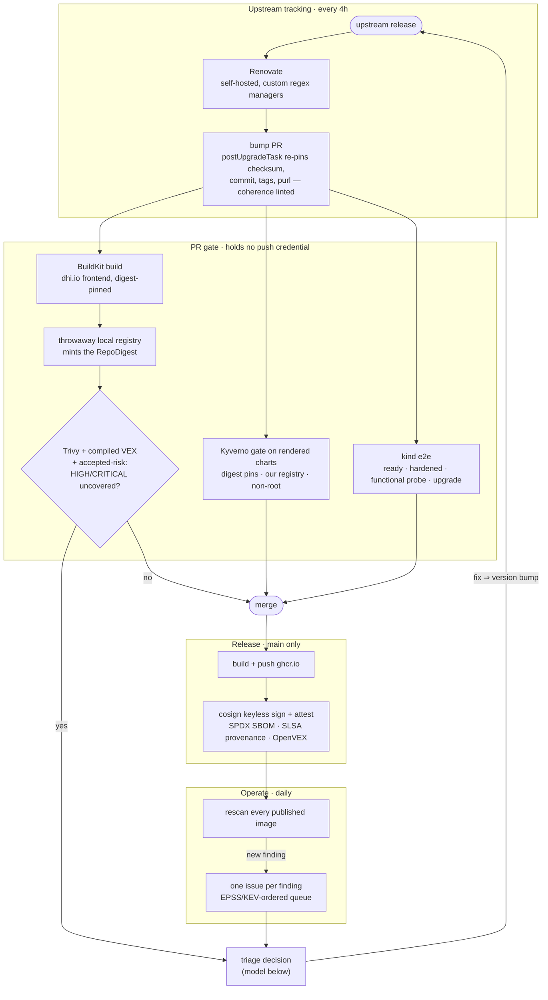
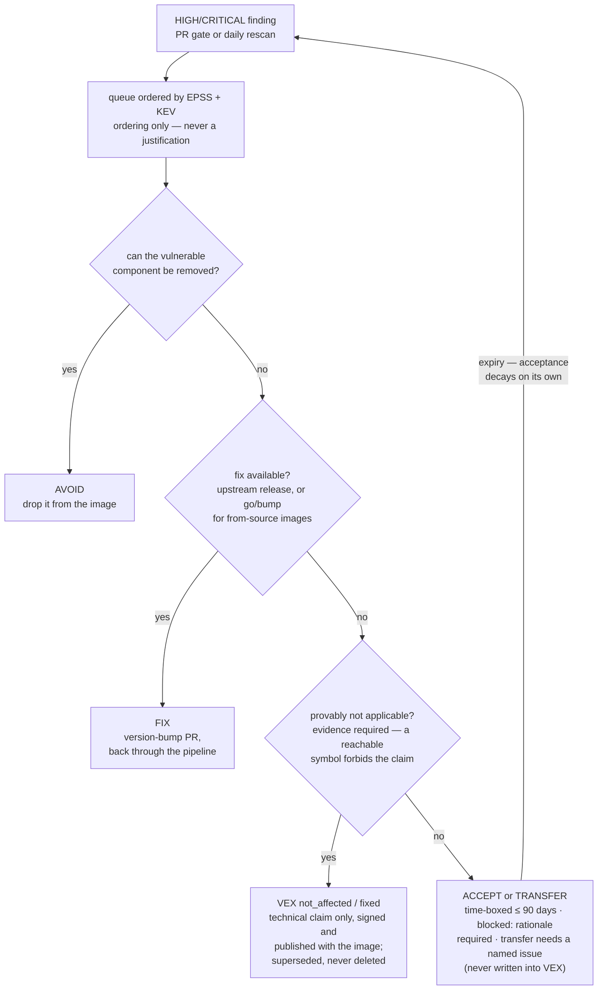

# dhc-pipeline

A miniature [Docker Hardened Images](https://docs.docker.com/dhi/)-style
catalogue, built as a skill-building project and then **operated**: image
definitions in native `dhi.io/build` syntax, upstream Helm charts adapted to
hardened non-root images, Renovate tracking upstream releases, Go integration
tests on real Kubernetes, and CVE triage recorded as portable OpenVEX. It grew
out of a one-image supply-chain lab (a hardened Go service plus Kyverno
admission policies — both carried over) into the full maintainer loop, and the
automation has been running unattended since 2026-07: real bump PRs, real scan
findings, real triage decisions, all in this repo's history.

## The pipeline



## Layout

| Path | What |
|---|---|
| `image/` | Definitions: hardened-app, cert-manager ×3, grafana, valkey (+`valkey-compat` variant) |
| `chart/` | Upstream charts pinned + hardened via overrides only; one owned chart |
| `test/` | Ginkgo/kind e2e: readiness, live securityContext, functional probes, upgrades |
| `triage/` | OpenVEX source, accepted-risk exceptions, decision log, upstream investigations |
| `policies/` | Kyverno gate: digest pins, allowed registry, non-root |
| `scripts/` | Tested glue: pin lints, VEX compiler, scanner installs |
| `.specs/` | EARS requirements, design, task ledger (the honest one — open gaps included) |
| `docs/` | Conventions, ADRs, operating-loop evidence |

## Verify an image

Every image published to `ghcr.io/mm-weber/dhc` is signed (cosign keyless via
GitHub OIDC) and carries an SPDX SBOM, OpenVEX, and BuildKit provenance:

```sh
REF=ghcr.io/mm-weber/dhc/grafana:13.1.3-alpine3.23
ID='--certificate-identity-regexp github.com/mm-weber/dhc-pipeline
    --certificate-oidc-issuer https://token.actions.githubusercontent.com'

cosign verify $ID "$REF"                                  # signature
cosign verify-attestation $ID --type spdxjson "$REF" \
  | jq -r '.payload | @base64d | fromjson | .predicate'   # SBOM
cosign verify-attestation $ID --type openvex "$REF" \
  | jq -r '.payload | @base64d | fromjson | .predicate'   # VEX, compiled per digest
# needs the buildx CLI plugin — without it docker mis-parses --format and
# prints its top-level usage (Debian/Ubuntu: apt install docker-buildx-plugin)
docker buildx imagetools inspect "$REF" --format '{{ json .Provenance }}'
```

## Triage, recorded

The PR scan gate (Trivy, Grype second opinion on CRITICALs) fails on any
HIGH/CRITICAL not covered by a VEX statement (`not_affected`/`fixed`, with
`govulncheck` reachability evidence) or a time-boxed accepted-risk exception
that decays back to un-triaged on expiry. Every decision is a commit:
[`triage/README.md`](triage/README.md) has the model,
[`triage/LOG.md`](triage/LOG.md) the history — including the retractions.



## Operating loop

Self-hosted Renovate (≤6h cron) opens pinned, checksum-recomputed bump PRs;
CI rebuilds, re-scans, and e2e-tests them; a daily rescan of published images
opens issues with severity/EPSS/KEV. See
[`docs/operating-loop.md`](docs/operating-loop.md) for a live trace.

## License

[MIT](LICENSE). Images repackage upstream software under upstream licenses
(noted per definition).
