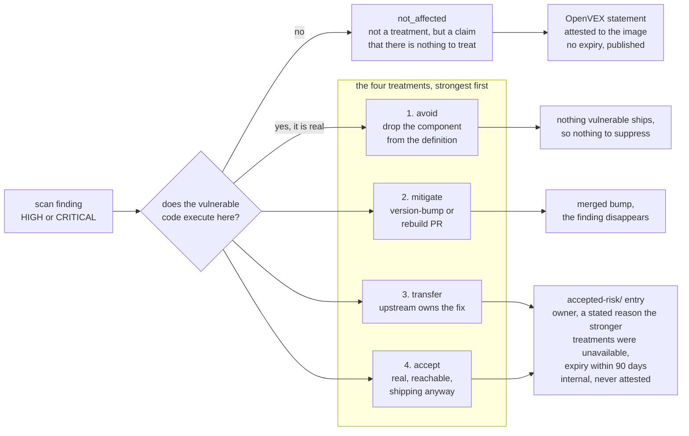

# dhc-pipeline: a hardened-image catalogue, built and left running

*A miniature Docker Hardened Images catalogue (six images, four Helm adaptations,
a CVE triage lane) built on the real DHI toolchain in three workdays, then left
operating unattended so its maintainer history accumulates on its own.*

## What it is

dhc-pipeline reproduces the working surface of a DHI engineering role end to end:
declarative image definitions, automated builds with supply-chain attestations,
upstream release tracking, Helm chart adaptation onto non-root images, Go
integration tests against real Kubernetes, and CVE triage recorded as portable,
machine-readable decisions.

Nothing is simulated. Images are authored in **native DHI syntax** and built by
Docker's own `dhi.io/build` BuildKit frontend. A three-hour spike established that
the frontend works outside Docker's infrastructure on the Community tier, which
retired the planned fallback of a bespoke YAML-to-Dockerfile renderer (ADR 0001).
Every other layer is equally standard: Renovate, Trivy and Grype, OpenVEX/vexctl,
cosign, Syft, Kyverno, Ginkgo v2 on kind.

> **[FIGURE 1: the pipeline]**

## Delivered

| | |
|---|---|
| **6 images, 4 archetypes** | from-source, monorepo to 3 images, tarball repackage, C-source stateful |
| **4 chart adaptations** | upstream charts consumed unmodified, every deviation documented with its rationale |
| **6 CI workflows** | validate, build and release, chart gate, kind e2e, Renovate cron (≤6h), daily rescan |
| **~2,600 lines of tested Go** | the kind e2e harness and the rescan reporter, both written test-first |
| **28 PRs, 109 commits** | against 8 EARS-notated requirements, 2 ADRs and a dated triage log |

Every published image carries a cosign keyless signature, an SPDX SBOM, SLSA
provenance and, where a triage decision exists, an OpenVEX attestation. Kyverno
gates rendered manifests on digest pinning, allowed registries and non-root
execution. The e2e suite then asserts that the live pods run as UID 65532 with a
read-only root filesystem and all capabilities dropped, and probes them
functionally: cert-manager issues a Certificate, Grafana answers health, Valkey
serves SET/GET.

> **[FIGURE 2: the triage decision model]**

## What running it for real turned up

- **A supply-chain integrity incident.** An upstream release tarball was replaced
  in place after publication while its published checksum sidecar was not
  regenerated. Our own build record from five days earlier proved the original pin
  had verified on both architectures. Fixed by pinning and fetching the immutable
  per-build artifact instead of the mutable version alias.
- **An invisible class of security release.** Grafana ships out-of-band fixes as
  semver build metadata (`13.0.1+security-01`), which semver ranks *below* the
  plain release. The tracker would have reported us up to date straight through a
  security release, on the one image carrying every open CVE.
- **Bumping is not monotonic.** The 13.0.4 to 13.1.1 fix bump cleared three stdlib
  findings from the main binary and introduced four new ones inside a bundled
  plugin. A version bump swaps a dependency graph rather than shrinking it.

**Status: operating.** Renovate opens bump PRs on a six-hour cron, the daily
rescan has filed eleven EPSS/KEV-enriched CVE issues without supervision, and the
gate stays red on the one CRITICAL where the honest answer is still *we don't
know yet*.

---

<!-- Production notes for the two figures, not page copy.
     Delete before exporting to a one-page PDF. -->

## Figure briefs

### Figure 1: the pipeline

Left-to-right flow, sized for a half-page-wide band. Renders natively on GitHub;
export to SVG or PNG into `images/` for the PDF.

```mermaid
flowchart LR
    DEF["image.yaml<br/>native DHI syntax"]
    FE["dhi.io/build<br/>BuildKit frontend"]
    DEF --> FE

    subgraph PRP ["Pull-request path"]
        direction TB
        PB["build amd64"]
        PS["Trivy scan gate<br/>consumes VEX + accepted-risk"]
        PG["Grype second opinion<br/>on CRITICAL"]
        PE["kind e2e<br/>live securityContext + probes"]
        PC["chart render<br/>Kyverno policy gate"]
        PB --> PS --> PG --> PE --> PC
    end

    subgraph RELP ["Release path, on main"]
        direction TB
        RB["build amd64 + arm64"]
        RR["push ghcr.io/mm-weber/dhc<br/>private"]
        RA["cosign signature<br/>SPDX SBOM<br/>SLSA provenance<br/>OpenVEX attestation"]
        RB --> RR --> RA
    end

    FE --> PB
    FE --> RB
    PC -->|merge| RB

    RN["Renovate cron, every 6h<br/>bump PR + checksum refresh"]
    RS["Daily rescan cron<br/>files CVE issue with EPSS + KEV"]
    TD["triage decision<br/>see Figure 2"]

    RA --> RS
    RS --> TD
    TD --> DEF
    RN --> DEF
```

**Caption:** "One definition file, two paths. Everything published is signed,
inventoried and attested, and two crons keep pushing new work back into the front
of the loop."

### Figure 2: the triage decision model

A finding enters on the left and leaves through one of five outlets. The single
question at the top is what separates them: `not_affected` sits outside the
treatment set entirely, because it is the claim that there was never any risk here
to treat.

**Caption:** "Two different questions. VEX says *does this apply to the artifact?*
Accepted-risk says *what are we doing about our exposure?* Conflating them is
VEX-washing, so the pipeline keeps them in separate files with separate lifetimes."
