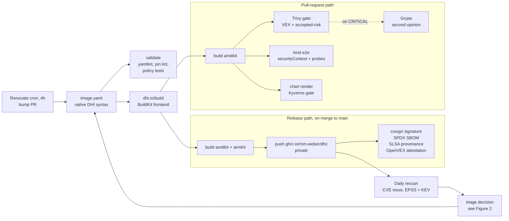
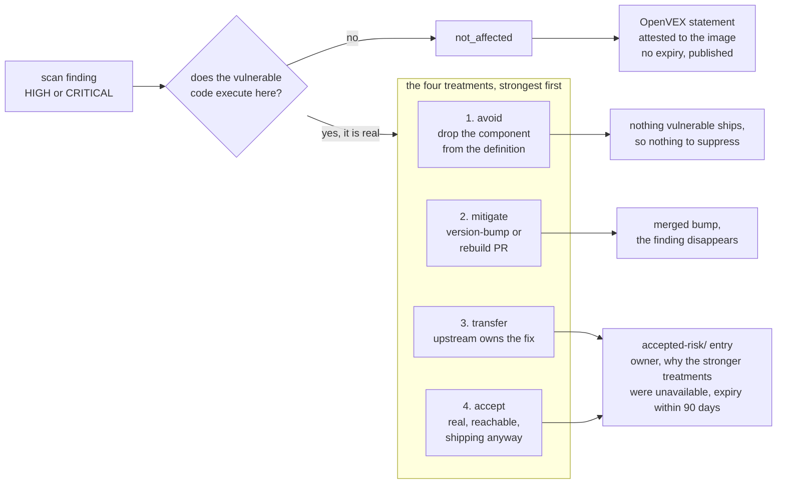

# dhc-pipeline: a hardened-image catalogue

*A miniature Docker Hardened Images catalogue of 6 images, 4 Helm charts and a CVE
triage lane, built to a three-day delivery plan on the real DHI toolchain, then
left operating.*

## What it is

dhc-pipeline reproduces the working surface of a DHI engineering role end to end.
Nothing is simulated: images are authored in **native DHI syntax** and built by
Docker's own `dhi.io/build` BuildKit frontend, after a three-hour spike proved it
works outside Docker's infrastructure on the Community tier (ADR 0001). Every
other layer is equally standard: Renovate, Trivy and Grype, OpenVEX/vexctl,
cosign, Syft, Kyverno, Ginkgo v2 on kind.

> **[FIGURE 1: the pipeline]**

## Delivered

| | |
|---|---|
| **6 images, 4 archetypes** | from-source · monorepo to 3 images · tarball repackage · C-source stateful |
| **4 charts** | 3 upstream adaptations consumed unmodified, 1 owned; every deviation documented with its rationale |
| **6 CI workflows** | validate · build and release · chart gate · kind e2e · Renovate cron (≤6h) · daily rescan |
| **~2,600 lines of tested Go** | the kind e2e harness and the rescan reporter, both written test-first |
| **28 PRs, 109 commits** | against 8 EARS-notated requirements, 2 ADRs and a dated triage log |

Every published image carries a cosign keyless signature, an SPDX SBOM and SLSA
provenance, plus an OpenVEX attestation wherever a triage decision exists. Kyverno
gates rendered manifests on digest pinning, allowed registries and non-root
execution. The e2e suite asserts that live pods run as UID 65532 with a read-only
root filesystem and all capabilities dropped, then probes them functionally:
cert-manager issues a Certificate, Grafana answers health.

> **[FIGURE 2: the triage decision model]**

## What running it for real turned up

- **A supply-chain integrity incident.** A published release tarball was
  overwritten about twenty hours after publication, so a pin taken on release day
  broke five days later with nothing in the version to explain it. Our own build
  record proved the original pin had verified on both architectures. Fixed by
  pinning and fetching the immutable per-build artifact instead of the mutable
  version alias.
- **An invisible class of security release.** Grafana ships out-of-band fixes as
  semver build metadata (`13.0.1+security-01`), which semver ignores for
  precedence, so it never ranks *above* the plain release. The tracker would have
  reported us up to date straight through a security release on the one image
  carrying every open CVE.
- **Bumping is not monotonic.** The 13.0.4 to 13.1.1 fix bump cleared three stdlib
  findings from the main binary and introduced four new ones inside a bundled
  plugin.

**Status: operating.** Renovate opens bump PRs on a four-hour cron, the daily
rescan has filed eleven CVE issues against nine distinct findings, enriched with
EPSS and KEV, and the grafana gate stays red on fifteen HIGH and one CRITICAL,
including the one where the honest answer is still *we do not know yet*.

---

<!-- Production notes for the two figures, not page copy.
     Delete before exporting to a one-page PDF. -->

## Figure briefs

### Figure 1: the pipeline

Two parallel bands, left to right. Renders natively on GitHub; export to SVG or
PNG into `images/` for the PDF.

**Caption:** "One definition file, two paths. Everything published is signed,
inventoried and attested, and two crons keep pushing new work back into the front
of the loop."

### Figure 2: the triage decision model

A finding enters on the left and leaves by one of five paths through four
outcomes. The single question on the left is what separates them: `not_affected`
sits outside the treatment set entirely, because it is the claim that there was
never any risk here to treat.

**Caption:** "Two different questions. VEX says *does this apply to the artifact?*
and is attested to the image with no expiry. Accepted-risk says *what are we doing
about our exposure?* and is internal, never attested, and expiring. Conflating
them is VEX-washing, so the pipeline keeps them in separate files with separate
lifetimes."
