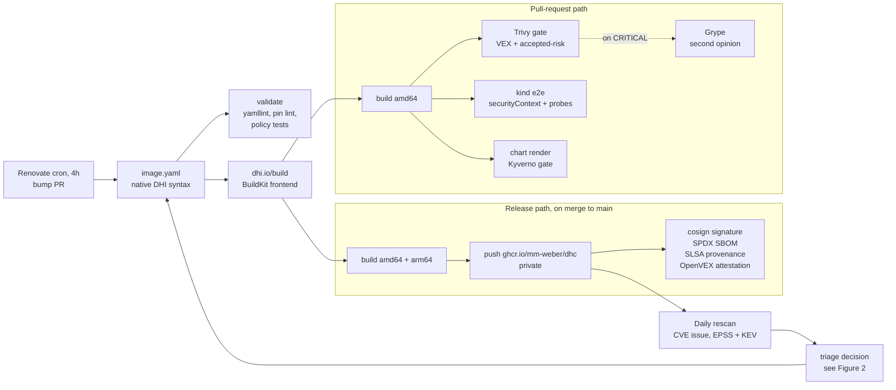
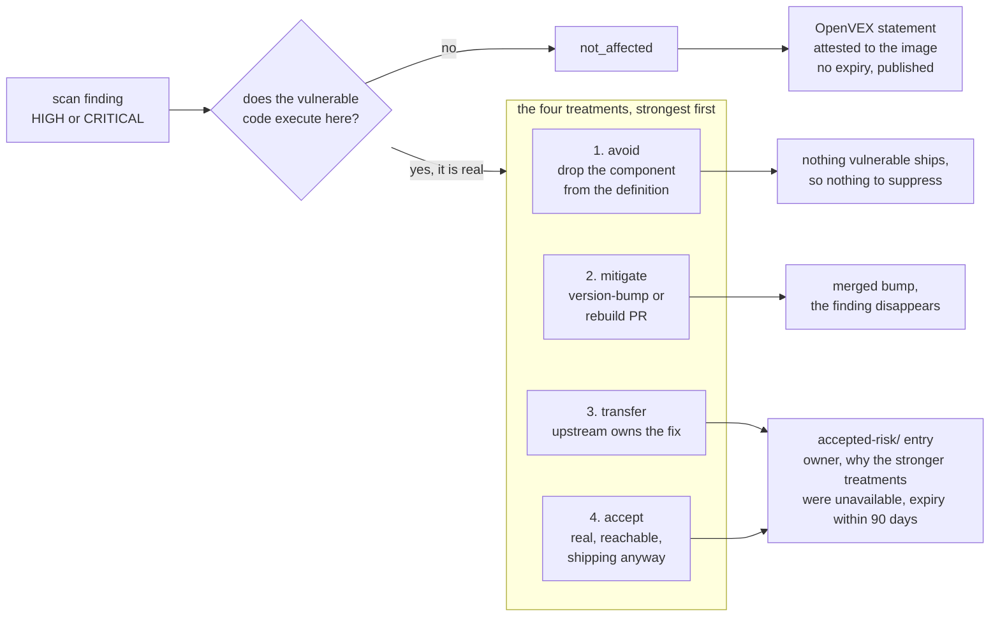

# dhc-pipeline: a hardened-image catalogue

*A miniature Docker Hardened Images catalogue of 6 images, 4 Helm charts and a CVE
triage lane, built to a three-day delivery plan on the real DHI toolchain, then
left operating.*

## What it is

dhc-pipeline reproduces the working surface of a DHI engineering role end to end:
declarative image definitions, automated builds with supply-chain attestations,
upstream release tracking, Helm chart adaptation onto non-root images, Go
integration tests against real Kubernetes, and CVE triage recorded as portable,
machine-readable decisions. Figure 1 overleaf is the whole machine on one diagram.

Nothing is simulated: images are authored in **native DHI syntax** and built by
Docker's own `dhi.io/build` BuildKit frontend, after a three-hour spike proved it
works outside Docker's infrastructure on the Community tier (ADR 0001). Every
other layer is equally standard: Renovate, Trivy and Grype, OpenVEX/vexctl,
cosign, Syft, Kyverno, Ginkgo v2 on kind.

## Delivered

| | |
|---|---|
| **6 images, 4 archetypes** | from-source · monorepo to 3 images · tarball repackage · C-source stateful |
| **4 charts** | 3 upstream adaptations consumed unmodified, 1 owned; every deviation documented with its rationale |
| **6 CI workflows** | validate · build and release · chart gate · kind e2e · Renovate cron (≤6h) · daily rescan |
| **~2,600 lines of tested Go** | the kind e2e harness and the rescan reporter, both written test-first |
| **28 PRs, 109 commits** | against 8 EARS-notated requirements, 2 ADRs and a dated triage log |

Every published image carries a cosign keyless signature, an SPDX SBOM and SLSA
provenance, plus an OpenVEX attestation wherever a triage decision exists. Kyverno
gates rendered manifests on digest pinning, allowed registries and non-root
execution. The e2e suite asserts that live pods run as UID 65532 with a read-only
root filesystem and all capabilities dropped, then probes them functionally:
cert-manager issues a Certificate, Grafana answers health.

Scan findings become recorded decisions rather than anecdotes. Figure 2 overleaf
is the model that governs them: a single question decides whether a finding
applies to the artifact at all, and the four treatments underneath it each produce
a different, auditable artifact.

## What running it for real turned up

- **An upstream artifact that moves.** Grafana rewrites its `/oss/release/`
  tarballs about twenty hours after a release, all four objects of the
  2026-07-21 batch inside one six-minute window, so this is routine automation
  rather than a one-off. A digest pinned on release day silently stops matching,
  with nothing in the version to explain it. Our own build provenance proved the
  original pin had verified on both architectures, which is what ruled out a bad
  pin on our side. Fixed by pinning the build-scoped artifact, which has not
  moved since release day, and by adding a CI check that fetches every pinned
  architecture so an unexercised pin cannot enter again.
- **An invisible class of security release.** Grafana ships out-of-band security
  fixes as `13.0.1+security-01`. The part after the `+` is a semver field the
  standard requires tools to **ignore when comparing versions**, so a security
  release ranks as neither newer nor older than the release it fixes. Verified
  against Renovate's own versioning module, where four of its five schemes rank
  the security build as *not newer*. The tracker would have reported us up to date
  straight through a security release on the image carrying the bulk of our open
  findings and our only open CRITICAL.
- **Bumping is not monotonic.** The 13.0.4 to 13.1.1 fix bump cleared three stdlib
  findings from the main binary and surfaced four new ones inside a bundled plugin
  binary that upstream did not rebuild. The same image ships grpc at three
  different versions. A version bump swaps a dependency graph rather than
  shrinking it.

**Status: operating.** Renovate opens bump PRs on a four-hour cron, the daily
rescan has filed eleven CVE issues against nine distinct findings, enriched with
EPSS and KEV, and the grafana gate stays red on fifteen HIGH and one CRITICAL,
including the one where the honest answer is still *we do not know yet*.

# Figures

## Figure 1: the pipeline

One definition file feeds two paths. The pull-request path gates a change; the
release path publishes and attests it. Two crons keep pushing new work back into
the front of the loop, which is what makes the catalogue an operating system
rather than a delivered artifact.

**Figure 1.** Nothing reaches the registry unsigned, uninventoried or
unattested, and nothing stays current by hand.

## Figure 2: the triage decision model

A finding enters on the left and leaves by one of five paths through four
outcomes. The question on the left is what separates them: `not_affected` sits
outside the treatment set entirely, because it is the claim that there was never
any risk here to treat.

**Figure 2.** Two different questions. VEX says *does this apply to the
artifact?* and is attested to the image with no expiry. Accepted-risk says *what
are we doing about our exposure?* and is internal, never attested, and expiring.
Conflating them is VEX-washing, so the pipeline keeps them in separate files with
separate lifetimes.

<!-- Page break above renders in HTML-based PDF exporters (Chrome print, VS Code
     Markdown PDF, wkhtmltopdf). For pandoc, replace the div with \newpage. -->
